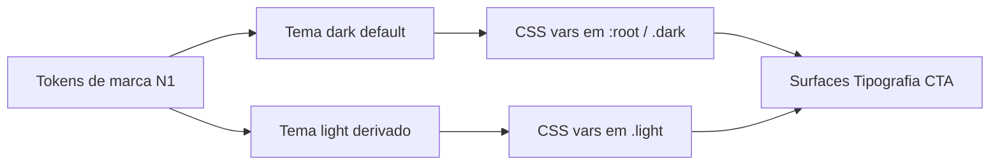

# Design System — Themes

## Contexto

O site [n1.ag](https://www.n1.ag/) é **dark-only** — não possui toggle de tema. Superfícies claras aparecem pontualmente (submenus, seletor de idioma, cards com gradiente).

Para o Toph Alert (dashboard), definimos dois temas semânticos derivados da marca, com **dark como default**.

## Arquitetura



## Contrato de tokens

| Token | Dark | Light | Descrição |
|-------|------|-------|-----------|
| `--bg` | `#0B1227` | `#F8F8F8` | Background da aplicação |
| `--surface` | `#0D1F5B` | `#FFFFFF` | Cards, sidebar, painéis |
| `--surface-elevated` | `#06144F` | `#FFFFFF` | Modais, dropdowns, popovers |
| `--text` | `#FFFFFF` | `#0D1F5B` | Texto primário |
| `--text-muted` | `#C8CEDB` | `#585858` | Texto secundário |
| `--accent` | `#36CAD8` | `#36CAD8` | Destaques interativos |
| `--accent-fg` | `#020E0F` | `#020E0F` | Texto sobre accent |
| `--cta` | `#F6AB00` | `#F6AB00` | Botões primários |
| `--cta-fg` | `#0D1F5B` | `#0D1F5B` | Texto sobre CTA |
| `--border` | `rgba(255,255,255,0.2)` | `#C7C7C7` | Bordas de componentes |
| `--border-subtle` | `rgba(255,255,255,0.1)` | `#E8E8E8` | Divisores |
| `--success` | `#2E7B3F` | `#2E7B3F` | Status positivo |
| `--warning` | `#E5B22D` | `#E5B22D` | Status atenção |
| `--danger` | `#DA452C` | `#DA452C` | Status erro |
| `--overlay` | `rgba(11,18,39,0.8)` | `rgba(0,0,0,0.4)` | Backdrop de modais |
| `--shadow` | `none` | `0 1px 2px rgba(0,0,0,0.05)` | Sombra sutil (light) |

### Tokens que não mudam entre temas

- `--accent` (ciano)
- `--cta` / `--cta-fg` (ouro + navy)
- `--success`, `--warning`, `--danger`

## Implementação CSS

```css
:root {
  color-scheme: dark;
}

:root,
.dark {
  --bg: #0B1227;
  --surface: #0D1F5B;
  --surface-elevated: #06144F;
  --text: #FFFFFF;
  --text-muted: #C8CEDB;
  --accent: #36CAD8;
  --accent-fg: #020E0F;
  --cta: #F6AB00;
  --cta-fg: #0D1F5B;
  --border: rgba(255, 255, 255, 0.2);
  --border-subtle: rgba(255, 255, 255, 0.1);
  --success: #2E7B3F;
  --warning: #E5B22D;
  --danger: #DA452C;
  --overlay: rgba(11, 18, 39, 0.8);
  --shadow: none;
}

.light {
  color-scheme: light;

  --bg: #F8F8F8;
  --surface: #FFFFFF;
  --surface-elevated: #FFFFFF;
  --text: #0D1F5B;
  --text-muted: #585858;
  --accent: #36CAD8;
  --accent-fg: #020E0F;
  --cta: #F6AB00;
  --cta-fg: #0D1F5B;
  --border: #C7C7C7;
  --border-subtle: #E8E8E8;
  --success: #2E7B3F;
  --warning: #E5B22D;
  --danger: #DA452C;
  --overlay: rgba(0, 0, 0, 0.4);
  --shadow: 0 1px 2px rgba(0, 0, 0, 0.05);
}
```

## Estratégia de toggle

### Default

- Tema **dark** é o padrão (alinhado à marca N1)
- `:root` inicia com tokens dark

### Mecanismo

1. Classe no `<html>`: `dark` (default) ou `light`
2. Atributo `color-scheme` sincronizado com o tema ativo
3. Persistência em `localStorage` com chave `toph-theme`

### Fluxo de inicialização

```
1. Script inline no <head> (antes do paint)
2. Lê localStorage('toph-theme')
3. Se existe → aplica classe correspondente
4. Se não existe → verifica prefers-color-scheme
5. Se prefers-color-scheme: light → aplica .light
6. Caso contrário → mantém dark (default da marca)
```

### Script de referência (Next.js)

```tsx
// components/theme-script.tsx
const themeScript = `
  (function() {
    const stored = localStorage.getItem('toph-theme');
    const prefersLight = window.matchMedia('(prefers-color-scheme: light)').matches;
    const theme = stored || (prefersLight ? 'light' : 'dark');
    document.documentElement.classList.remove('dark', 'light');
    document.documentElement.classList.add(theme);
  })();
`;
```

### Toggle component

```tsx
function toggleTheme() {
  const html = document.documentElement;
  const current = html.classList.contains('light') ? 'light' : 'dark';
  const next = current === 'dark' ? 'light' : 'dark';
  html.classList.remove('dark', 'light');
  html.classList.add(next);
  localStorage.setItem('toph-theme', next);
}
```

## Superfícies por tema

### Dark

| Superfície | Background | Border | Text |
|------------|------------|--------|------|
| App | `--bg` | — | `--text` |
| Sidebar | `--surface` | `--border-subtle` | `--text` |
| Card | `--surface` | `--border` | `--text` |
| Card elevated | `--surface-elevated` | `--border` | `--text` |
| Input | transparent | `--border` | `--text` |
| Modal | `--surface-elevated` | `--border` | `--text` |

### Light

| Superfície | Background | Border | Text |
|------------|------------|--------|------|
| App | `--bg` | — | `--text` |
| Sidebar | `--surface` | `--border` | `--text` |
| Card | `--surface` | `--border` + `--shadow` | `--text` |
| Card elevated | `--surface-elevated` | `--border` + `--shadow` | `--text` |
| Input | `--surface` | `--border` | `--text` |
| Modal | `--surface-elevated` | `--border` + `--shadow` | `--text` |

## Acessibilidade

### Contraste WCAG AA

| Par | Tema | Ratio | Status |
|-----|------|-------|--------|
| `--text` sobre `--bg` | Dark | >15:1 | Pass |
| `--text` sobre `--surface` | Dark | >12:1 | Pass |
| `--text-muted` sobre `--bg` | Dark | >7:1 | Pass |
| `--accent` sobre `--bg` | Ambos | ~8:1 | Pass |
| `--cta-fg` sobre `--cta` | Ambos | ~6:1 | Pass (large text) |
| `--text` sobre `--bg` | Light | >12:1 | Pass |
| `--text-muted` sobre `--bg` | Light | ~5.5:1 | Pass |

### Regras

- Nunca usar `--accent` como cor de texto em body (apenas destaques/stats)
- CTAs primários sempre `--cta` bg + `--cta-fg` texto
- Focus ring visível em ambos os temas: `2px solid var(--accent)`
- Respeitar `prefers-reduced-motion` em transições de tema
- Transição de tema: `transition: background-color 300ms, color 300ms` em `body`

### Focus visible

```css
:focus-visible {
  outline: 2px solid var(--accent);
  outline-offset: 2px;
}
```

## Integração Tailwind v4

```css
@import "tailwindcss";

@custom-variant dark (&:is(.dark *));
@custom-variant light (&:is(.light *));

@theme {
  --color-bg: var(--bg);
  --color-surface: var(--surface);
  --color-surface-elevated: var(--surface-elevated);
  --color-text: var(--text);
  --color-text-muted: var(--text-muted);
  --color-accent: var(--accent);
  --color-cta: var(--cta);
  --color-cta-fg: var(--cta-fg);
  --color-border: var(--border);
  --color-success: var(--success);
  --color-warning: var(--warning);
  --color-danger: var(--danger);
}
```

## Testes de tema

Checklist para validação:

- [ ] Toggle persiste após reload
- [ ] First paint sem flash (script inline)
- [ ] Todos os componentes legíveis em ambos os temas
- [ ] Focus ring visível em dark e light
- [ ] Contraste AA em textos, botões e badges
- [ ] `prefers-color-scheme` respeitado apenas sem preferência salva
- [ ] `prefers-reduced-motion` desativa transições de tema
