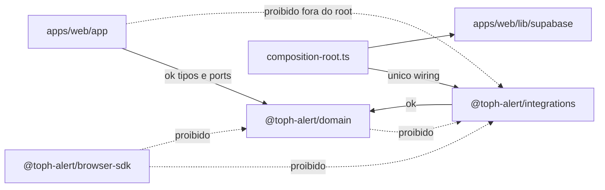

# ADR 001 — Enforcement de camadas

**Status**: Aceito com restrições  
**Criado em**: 13/08/2026  
**Atualizado em**: 13/08/2026  
**Autor**: Netinho  
**Revisão**: Conselho de Engenharia (13/08/2026)

## Contexto

O monorepo **toph-alert** segue DDD + ports/adapters (hexagonal). As regras de camada estão em [AGENTS.md](../../AGENTS.md); este ADR define o **grafo dirigido** de imports e como enforceá-lo sem bloquear o escopo V1 (T05–T15).

Uma proposta inicial citava `dependency-cruiser` com regras que **invertiam o hexágono** (proibindo `apps/web/app` de importar `@toph-alert/domain`) e apontavam pacotes inexistentes (`packages/infrastructure`, `apps/web/lib/repositories.ts`). Essas regras foram **rejeitadas**.

## Decisão

### 1. Documentar o grafo real (fonte de verdade)

| Pacote / módulo                                      | Pode importar                                                               | Não pode importar                                                                                  |
| ---------------------------------------------------- | --------------------------------------------------------------------------- | -------------------------------------------------------------------------------------------------- |
| `@toph-alert/domain` (`packages/domain`)             | Nada externo ao pacote                                                      | `@toph-alert/integrations`, `@toph-alert/browser-sdk`, `next`, `@supabase/*`, código de `apps/web` |
| `@toph-alert/integrations` (`packages/integrations`) | `@toph-alert/domain`                                                        | `apps/web`, `@toph-alert/browser-sdk`                                                              |
| `@toph-alert/browser-sdk` (`packages/browser-sdk`)   | Nada de server/adapters                                                     | `@toph-alert/domain`, `@toph-alert/integrations`, `@supabase/*`, `apps/web/lib/composition-root`   |
| `apps/web/app` e UI (rotas, components)              | `@toph-alert/domain` (tipos, fingerprint, ports)                            | `@toph-alert/integrations` — adapters HTTP só via composition root                                 |
| `apps/web/lib/composition-root.ts`                   | `@toph-alert/domain`, `@toph-alert/integrations`, `apps/web/lib/supabase/*` | Único ponto de wiring de adapters                                                                  |
| Persistência Supabase                                | `apps/web/lib/supabase/*`                                                   | Não criar `packages/infrastructure` no V1                                                          |



### 2. Enforcement V1 — ESLint `no-restricted-imports`

Enforcement imediato via [eslint.config.mjs](../../eslint.config.mjs) (já roda no pre-commit via Husky/lint-staged):

- **domain** → bloqueia imports de integrations, browser-sdk, next, supabase
- **integrations** → bloqueia browser-sdk
- **browser-sdk** → bloqueia domain e integrations
- **apps/web** (exceto `lib/composition-root.ts`) → bloqueia `@toph-alert/integrations`

### 3. `dependency-cruiser` — adiado

**Não instalar** `dependency-cruiser` no V1. Motivos:

- Repo pequeno (~50 arquivos TS); ESLint cobre imports diretos nas 4 arestas críticas
- Sem CI (`.github/workflows/`), gate local é insuficiente para grafo completo
- `lint-staged` incremental não valida grafo; scan completo no pre-commit degrada DX

**Follow-up** (quando existir CI), adicionar:

1. `dependency-cruiser` como `devDependency` na raiz
2. Script `pnpm lint:deps` → `depcruise apps packages --config .dependency-cruiser.cjs`
3. Config com `exclude`: `.next`, `node_modules`, `dist`, `coverage`
4. Regras: `no-circular`, reachability `browser-sdk` / `'use client'` ↛ `lib/supabase` admin / integrations
5. Fixture negativo (arquivo ou teste de config) que prove violação → exit code ≠ 0
6. Gate no CI (não no `lint-staged`)

Referência: [dependency-cruiser no NPM](https://www.npmjs.com/package/dependency-cruiser)

## O que NÃO fazer

- Proibir `apps/web/app` de importar `@toph-alert/domain` — rotas são **driving adapters** e dependem do domínio
- Inventar `packages/infrastructure` ou `apps/web/lib/repositories.ts`
- Matching só por path de filesystem (`^packages/infrastructure`) — usar specifiers `@toph-alert/*`
- “Usar 100% da biblioteca” com regras enciclopédicas DDD — poucas arestas alinhadas ao código
- Rodar `depcruise` no `lint-staged`

## Regras de exemplo rejeitadas (histórico)

A proposta original continha erros arquiteturais documentados aqui para evitar regressão:

```json
// REJEITADO — inverte hexágono e cita pacotes inexistentes
{
  "name": "pages-sem-packages-internos",
  "comment": "Rotas app/ não importam domain nem infrastructure.",
  "from": { "path": "^apps/web/app" },
  "to": { "path": "^packages/(domain|infrastructure)" }
}
```

## Consequências

- **Positivas**: grafo documentado; ESLint impede vazamento direto de integrations fora do composition root; domain permanece puro
- **Negativas**: ESLint não detecta import transitivo via barrel; reachability client→admin exige `dependency-cruiser` + CI no follow-up
- **Riscos residuais**: sem CI, enforcement depende de dev rodar `pnpm lint` localmente

## Critérios de aceite (V1)

- [x] ADR descreve grafo real do monorepo
- [x] `eslint.config.mjs` enforce as 4 arestas com allowlist em `composition-root.ts`
- [x] `apps/web/app/page.tsx` não importa `@toph-alert/integrations` nem `@toph-alert/browser-sdk` (smoke)
- [ ] `dependency-cruiser` + `pnpm lint:deps` + CI — follow-up pós-piloto

## Referências

- [AGENTS.md](../../AGENTS.md) — regras de camada e composition root
- [apps/web/lib/composition-root.ts](../../apps/web/lib/composition-root.ts) — wiring único de adapters
