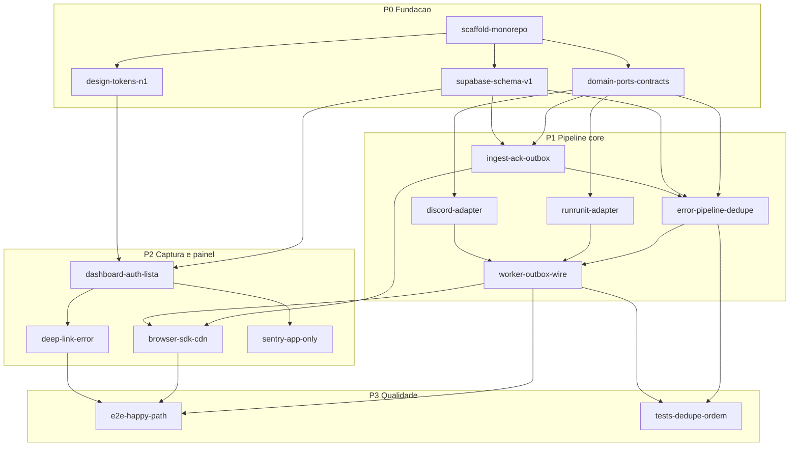

# Backlog orquestrado V1 — toph-alert

> Source of truth operacional do MVP. Derivado do [plano Conselho](../.cursor/plans/mvp_toph-alert_conselho_173976f8.plan.md), [`.spec/`](../.spec/) e [`contexto.mdc`](contexto.mdc).

---

## 1. Executive Summary

Estamos construindo o **toph-alert V1** para a equipe interna de desenvolvimento monitorar erros em lojas ecommerce via **SDK browser** (install por script CDN), com ingest assíncrono, dedupe por fingerprint, abertura automática de ticket no **Runrunit** e alerta no **Discord** — resolvendo o problema de descoberta tardia de erros e abertura manual de tickets pelos gestores das lojas. O critério de sucesso é instalar o snippet em uma loja piloto, disparar um erro de teste e vê-lo no painel interno (com ticket/Discord quando credenciais estiverem configuradas).

## 2. Epic Hypothesis

Acreditamos que um **SDK próprio + pipeline assíncrono (ingest → dedupe → Runrunit → Discord)** para a equipe interna aumentará a velocidade de detecção e correção de erros em produção, porque hoje os gestores perdem tempo abrindo tickets manualmente e clientes continuam sofrendo o mesmo erro até a investigação começar. Mediremos sucesso pelo happy path V1: script na loja → erro no painel → ticket criado → Discord notificado (ordem garantida).

---

## 3. Regra do composition root (wiring automático)

Nenhuma feature deve exigir “ligar na mão” depois. Toda entrega segue:

1. **Porta** definida em `packages/domain` (`TicketPort`, `NotifyPort`, `ErrorStore`, etc.).
2. **Adapter** implementado em `packages/integrations` (Runrunit, Discord) ou em `apps/web` (Supabase store, rotas).
3. **Registro** na factory única do composition root em `apps/web` (ex.: `lib/composition-root.ts` ou equivalente) — ingest, worker e pipeline recebem dependências já injetadas.

| Camada                  | Responsabilidade                                   | Não faz                        |
| ----------------------- | -------------------------------------------------- | ------------------------------ |
| `packages/domain`       | Tipos, fingerprint, dedupe, orquestração via ports | HTTP para Runrunit/Discord     |
| `packages/integrations` | Adapters HTTP (Runrunit, Discord)                  | Lógica de negócio / dedupe     |
| `apps/web`              | Composition root, rotas, worker outbox, UI         | Detalhes de API externa inline |

**Stub quando env ausente:** se `RUNRUNIT_*` ou webhook Discord não estiverem configurados, o composition root registra adapters no-op com log — o fluxo compila e roda sem crash; E2E usa mocks ou credenciais reais.

---

## 4. Grafo de dependências



---

## 5. Labels de pacote

| Label              | Pacote / superfície                                 |
| ------------------ | --------------------------------------------------- |
| `pkg:repo`         | Raiz monorepo (workspaces, scripts, `.env.example`) |
| `pkg:web`          | `apps/web`                                          |
| `pkg:domain`       | `packages/domain`                                   |
| `pkg:browser-sdk`  | `packages/browser-sdk`                              |
| `pkg:integrations` | `packages/integrations`                             |
| `pkg:supabase`     | Migrations / schema Supabase                        |

---

## 6. Tabela resumo (por prioridade)

| ID  | Título                             | Prioridade | Labels                                                                     | Pendência     |
| --- | ---------------------------------- | ---------- | -------------------------------------------------------------------------- | ------------- |
| T01 | Scaffold monorepo                  | P0         | `pkg:repo`, `pkg:web`, `pkg:domain`, `pkg:browser-sdk`, `pkg:integrations` | —             |
| T02 | Contratos do domínio               | P0         | `pkg:domain`                                                               | T01           |
| T03 | Schema Supabase V1                 | P0         | `pkg:supabase`, `pkg:web`                                                  | T01           |
| T04 | Tokens design system N1            | P0         | `pkg:web`                                                                  | T01           |
| T05 | POST /api/ingest ACK + outbox      | P1         | `pkg:web`, `pkg:domain`                                                    | T02, T03      |
| T06 | ErrorPipeline + dedupe/claim       | P1         | `pkg:domain`, `pkg:web`                                                    | T02, T03, T05 |
| T07 | Adapter Runrunit                   | P1         | `pkg:integrations`, `pkg:domain`                                           | T02           |
| T08 | Adapter Discord                    | P1         | `pkg:integrations`, `pkg:domain`                                           | T02           |
| T09 | Worker outbox (Runrunit → Discord) | P1         | `pkg:web`, `pkg:domain`, `pkg:integrations`                                | T06, T07, T08 |
| T10 | Browser SDK + snippet CDN          | P2         | `pkg:browser-sdk`, `pkg:web`                                               | T05           |
| T11 | Painel interno (lista/filtro)      | P2         | `pkg:web`                                                                  | T03, T04      |
| T12 | Deep-link `/errors/[id]`           | P2         | `pkg:web`                                                                  | T11           |
| T13 | Sentry app-only                    | P2         | `pkg:web`                                                                  | T11           |
| T14 | Happy path E2E piloto              | P3         | `pkg:web`, `pkg:browser-sdk`, `pkg:integrations`                           | T09, T10, T12 |
| T15 | Testes dedupe + ordem Discord      | P3         | `pkg:domain`, `pkg:integrations`, `pkg:web`                                | T06, T09      |

---

## 7. Tasks detalhadas

### T01 — Scaffold monorepo

- **Prioridade:** P0
- **Labels:** `pkg:repo`, `pkg:web`, `pkg:domain`, `pkg:browser-sdk`, `pkg:integrations`
- **Pendência:** nenhuma
- **Desbloqueia:** T02, T03, T04
- **Entrega:**
  - Workspaces na raiz (pnpm/npm workspaces ou Turborepo)
  - `apps/web` via `create-next-app@latest` (Next 16.2.12, TypeScript, Tailwind, App Router)
  - `packages/domain`, `packages/browser-sdk`, `packages/integrations` com `package.json` + exports
  - Scripts `dev` / `build` na raiz
  - `.env.example` com chaves: Supabase, Runrunit (`RUNRUNIT_APP_KEY`, `RUNRUNIT_USER_TOKEN`, `project_id`/`type_id`), Discord webhook, Sentry
- **Aceite integrado:** `pnpm dev` (ou `npm run dev`) sobe `apps/web`; imports workspace entre pacotes funcionam sem publish
- **Spec:** [`.spec/01-nextjs-app/install-and-initi.md`](../.spec/01-nextjs-app/install-and-initi.md)

---

### T02 — Contratos do domínio (ports + tipos)

- **Prioridade:** P0
- **Labels:** `pkg:domain`
- **Pendência:** T01
- **Desbloqueia:** T05, T06, T07, T08
- **Entrega:**
  - Tipos: `IngestPayload`, `Erro`, `Fingerprint`, estados (`novo` → `processing` → `ticket_aberto`)
  - Ports: `TicketPort`, `NotifyPort`, `ErrorStore` (persistência abstrata)
  - Função de fingerprint estável a partir do payload
  - **Sem** HTTP Runrunit/Discord neste pacote
- **Aceite integrado:** exports públicos em `packages/domain`; `apps/web` tipa rotas/worker contra esses contratos (compile-time)
- **Spec:** [`.spec/03-ingest/consumo-erro.md`](../.spec/03-ingest/consumo-erro.md) (contrato do erro)

---

### T03 — Schema Supabase V1

- **Prioridade:** P0
- **Labels:** `pkg:supabase`, `pkg:web`
- **Pendência:** T01
- **Desbloqueia:** T05, T06, T11
- **Entrega:**
  - Tabela `lojas`: `store_key`, `allowed_origins`, metadados mínimos
  - Tabela `erros`: `loja_id`, `fingerprint`, stack/trace, status, timestamps; **unique** `(loja_id, fingerprint)`
  - Tabela `tickets`: vínculo com erro + id externo Runrunit
  - Tabela `outbox`: fila com steps `create_ticket` | `notify`, payload, retry count, status
  - Supabase Auth para equipe interna apenas
  - **Sem** tabela `clientes`, RLS multi-tenant ou painel assinante
- **Aceite integrado:** client Supabase em `apps/web` lê/escreve o schema; migration versionada no repositório
- **Spec:** plano Conselho (schema V1) + skill Supabase em `.cursor/skills/supabase/`

---

### T04 — Tokens design system N1

- **Prioridade:** P0
- **Labels:** `pkg:web`
- **Pendência:** T01
- **Desbloqueia:** T11
- **Entrega:**
  - CSS variables + Tailwind v4 `@theme`
  - Paleta N1: navy `#0B1227`, ciano `#36CAD8`, ouro CTA `#F6AB00`
  - Dark mode como default
  - Tipografia: Archimoto com fallback Montserrat até licença
  - Layout shell mínimo do dashboard consumindo tokens
- **Aceite integrado:** página root do app já renderiza com tokens aplicados (não precisa polir todos os componentes)
- **Spec:** [`.spec/02-design-system/`](../.spec/02-design-system/)

---

### T05 — POST /api/ingest ACK + outbox

- **Prioridade:** P1
- **Labels:** `pkg:web`, `pkg:domain`
- **Pendência:** T02, T03
- **Desbloqueia:** T06, T10
- **Entrega:**
  - Rota `POST /api/ingest`
  - Validação: `store_key`, origin vs `allowed_origins`, rate limit por loja
  - Upsert em `erros` + enqueue em `outbox` (step inicial)
  - Resposta **202 Accepted** — sem chamada síncrona a Runrunit/Discord
  - Composition root registra `ErrorStore` (adapter Supabase)
- **Aceite integrado:** `curl` ou stub → HTTP 202 + registros em `erros` e `outbox`
- **Spec:** [`.spec/03-ingest/consumo-erro.md`](../.spec/03-ingest/consumo-erro.md)

---

### T06 — ErrorPipeline + dedupe/claim atômico

- **Prioridade:** P1
- **Labels:** `pkg:domain`, `pkg:web`
- **Pendência:** T02, T03, T05
- **Desbloqueia:** T09, T15
- **Entrega:**
  - Pipeline orquestra dedupe via unique `(loja_id, fingerprint)`
  - Claim atômico com status `processing` antes de abrir ticket
  - Idempotência: segundo evento igual não dispara novo ticket
  - Orquestração via ports (stubs/no-ops até T07/T08, mas estrutura já plugável)
- **Aceite integrado:** dois payloads idênticos → um erro, um claim; segundo evento não cria segundo ticket
- **Spec:** plano Conselho (dedupe + claim)

---

### T07 — Adapter Runrunit (`TicketPort`)

- **Prioridade:** P1
- **Labels:** `pkg:integrations`, `pkg:domain`
- **Pendência:** T02
- **Desbloqueia:** T09
- **Entrega:**
  - Pacote `runrunit-client` em `packages/integrations`
  - Implementa `TicketPort`
  - Headers: `App-Key`, `User-Token`
  - `POST https://runrun.it/api/v1.0/tasks`
  - `project_id` / `type_id` por variável de ambiente (por `NODE_ENV`)
  - Retry com exponential backoff em 5xx e 429
  - Descrição do ticket enriquecida com stack/trace (quando disponível)
- **Aceite integrado:** factory em `apps/web` registra adapter real quando envs presentes; senão stub com log — **na mesma entrega**
- **Spec:** [`.spec/05-runrunit/integracao.md`](../.spec/05-runrunit/integracao.md)

---

### T08 — Adapter Discord (`NotifyPort`)

- **Prioridade:** P1
- **Labels:** `pkg:integrations`, `pkg:domain`
- **Pendência:** T02
- **Desbloqueia:** T09
- **Entrega:**
  - Pacote `discord-webhook` em `packages/integrations`
  - Implementa `NotifyPort`
  - Sanitização básica de payload (evitar XSS em mensagens)
  - Interface pluggável para futuros providers (Slack, WhatsApp, Gmail)
- **Aceite integrado:** mesmo composition root de T07 registra Discord; sem wiring manual posterior
- **Spec:** [`.spec/04-notifications/discord.md`](../.spec/04-notifications/discord.md)

---

### T09 — Worker outbox (ordem Runrunit → Discord)

- **Prioridade:** P1
- **Labels:** `pkg:web`, `pkg:domain`, `pkg:integrations`
- **Pendência:** T06, T07, T08
- **Desbloqueia:** T10, T14, T15
- **Entrega:**
  - Worker (cron route, edge function ou job periódico) processa fila `outbox`
  - Step 1 `create_ticket`: chama `TicketPort`; só em **200/204** avança
  - Step 2 `notify`: chama `NotifyPort` (Discord)
  - Atualiza erro para `ticket_aberto`
  - Retry/DLQ simples: falha Discord não desfaz ticket; retry apenas do step `notify`
  - Composition root injeta pipeline + ports no worker
- **Aceite integrado:** job E2E com mocks — ticket OK → Discord; Discord **nunca** dispara sem ticket confirmado; falha Discord mantém ticket e reprocessa notify
- **Spec:** [`.spec/04-notifications/discord.md`](../.spec/04-notifications/discord.md), [`.spec/05-runrunit/integracao.md`](../.spec/05-runrunit/integracao.md)

---

### T10 — Browser SDK + snippet CDN

- **Prioridade:** P2
- **Labels:** `pkg:browser-sdk`, `pkg:web`
- **Pendência:** T05
- **Desbloqueia:** T14
- **Entrega:**
  - Captura de erros no browser (`window.onerror`, `unhandledrejection`, etc.)
  - Payload com stack, traces e `store_key`
  - Snippet install: `<script src="..." data-store-key="...">`
  - Build publicado em `public/` do web ou CDN configurado
  - Documentação mínima de install (CSP, origins)
- **Aceite integrado:** snippet em página estática de teste → POST no ingest sem config manual além do `store_key` cadastrado em `lojas`
- **Spec:** [`.spec/03-ingest/consumo-erro.md`](../.spec/03-ingest/consumo-erro.md)

---

### T11 — Painel interno (lista/filtro por loja)

- **Prioridade:** P2
- **Labels:** `pkg:web`
- **Pendência:** T03, T04
- **Desbloqueia:** T12, T13
- **Entrega:**
  - Auth Supabase (equipe interna)
  - Lista de erros com filtro por loja
  - UI dark N1 enxuta (lista + filtros; sem polir todo o design system)
  - Visão global — equipe vê todas as lojas (V1)
- **Aceite integrado:** erros criados pelo ingest aparecem na lista sem sync ou seed manual
- **Spec:** [`.spec/02-design-system/overview.md`](../.spec/02-design-system/overview.md)

---

### T12 — Deep-link autenticado `/errors/[id]`

- **Prioridade:** P2
- **Labels:** `pkg:web`
- **Pendência:** T11
- **Desbloqueia:** T14
- **Entrega:**
  - Página de detalhe do erro: stack, trace, metadados, loja
  - URL compartilhável apenas para usuário autenticado
  - Deep-link incluído na descrição do ticket Runrunit (mapping em T07/pipeline)
  - Deep-link opcional na mensagem Discord
- **Aceite integrado:** link no ticket ou Discord abre o mesmo erro no painel (sessão válida)
- **Spec:** [`.spec/03-ingest/consumo-erro.md`](../.spec/03-ingest/consumo-erro.md)

---

### T13 — Sentry app-only

- **Prioridade:** P2
- **Labels:** `pkg:web`
- **Pendência:** T11
- **Desbloqueia:** —
- **Entrega:**
  - Instrumentação Sentry apenas em `apps/web` (dashboard)
  - Escopo: errors + tracing (first-error)
  - **Sem** Session Replay no MVP
  - Config edge corrigida (replay não pertence ao edge)
  - Lojas usam SDK próprio, não Sentry
- **Aceite integrado:** erro forçado no dashboard aparece no projeto Sentry configurado
- **Spec:** [`.spec/00-sentry/install-and-init.md`](../.spec/00-sentry/install-and-init.md)

---

### T14 — Happy path E2E piloto

- **Prioridade:** P3
- **Labels:** `pkg:web`, `pkg:browser-sdk`, `pkg:integrations`
- **Pendência:** T09, T10, T12
- **Desbloqueia:** —
- **Entrega:**
  - Loja piloto cadastrada em `lojas` com `store_key` e origins
  - Script SDK instalado em página de teste
  - Erro de teste disparado
  - Verificação: painel lista o erro → detalhe via deep-link → ticket Runrunit (credenciais ou mock) → Discord após 200/204
  - Checklist documentado em `docs/` ou README
- **Aceite integrado:** critério de sucesso V1 — “instalar em outra loja e receber erros”
- **Spec:** plano Conselho (critério de aceite #8)

---

### T15 — Testes focados (dedupe + ordem Discord)

- **Prioridade:** P3
- **Labels:** `pkg:domain`, `pkg:integrations`, `pkg:web`
- **Pendência:** T06, T09
- **Desbloqueia:** —
- **Entrega:**
  - Unit: fingerprint e dedupe (dois eventos → um ticket)
  - Contrato: schema/payload do ingest
  - Integração com mocks: ordem Runrunit antes de Discord
  - Cenário: falha Discord após ticket OK → retry só notify
  - **Sem** suíte RLS cross-tenant (V2)
- **Aceite integrado:** `pnpm test` (ou script equivalente) verde nos testes críticos listados
- **Spec:** plano Conselho (quality gates)

---

## 8. Ordem de execução sugerida

Trilha crítica (sequencial mínimo):

```
T01 → T02 + T03 + T04 (paralelo) → T05 → T06 → T07 + T08 (paralelo) → T09 → T10 + T11 (paralelo) → T12 → T14
                                                                              └→ T13 (paralelo a T12)
T06 + T09 → T15 (pode iniciar após T09)
```

**Paralelismo seguro após T01:** T02, T03, T04  
**Paralelismo seguro após T02:** T07, T08 (em paralelo com T05/T06 se T03 pronto)  
**Paralelismo seguro após T09:** T10 e T11  
**Paralelismo seguro após T11:** T12 e T13

---

## 9. Fora do backlog V1 (backlog V2)

Não criar tasks para os itens abaixo nesta fase:

| Item                                               | Motivo                                         |
| -------------------------------------------------- | ---------------------------------------------- |
| Multi-tenant de produto (`clientes`, assinante)    | Escopo V2; V1 é painel interno apenas          |
| RLS por `cliente_id` / isolamento entre lojistas   | Schema V1 sem `clientes`; hardening na V2      |
| Painel do lojista (só a própria loja)              | Persona assinante adiada                       |
| Membership complexa / roles admin vs assinante     | Auth mínima equipe interna na V1               |
| Session Replay (Sentry nas lojas ou app)           | Fora do MVP first-error                        |
| Novos notify providers (Slack, WhatsApp, Gmail)    | Interface pluggável na V1; implementação V2    |
| Novos ticket providers (Jira, Linear, Monday)      | Runrunit único na V1                           |
| Polimento completo do design system                | Tokens N1 bastam; componentes completos depois |
| Quotas e rate limiting avançado multi-tenant       | Rate limit básico por loja na V1               |
| Rotação/revogação avançada de `store_key`          | Origin allowlist + rate limit na V1            |
| SDK para plataformas além de browser (server-side) | Browser script único na V1                     |
| Testes RLS cross-tenant                            | Sem multi-tenant na V1                         |

---

## 10. Métricas de sucesso (V1)

| Métrica             | Alvo                                                                    |
| ------------------- | ----------------------------------------------------------------------- |
| Happy path completo | 1 loja piloto com erro visível no painel em &lt; 5 min após install     |
| Dedupe              | 0 tickets duplicados para mesmo fingerprint+loja em burst de 10 eventos |
| Ordem notify        | 100% dos Discord só após Runrunit 200/204 (em testes automatizados)     |
| Latência ingest     | p95 do ACK &lt; 500 ms (sem esperar Runrunit/Discord)                   |

---

## 11. Referências

- [Plano Conselho MVP](../.cursor/plans/mvp_toph-alert_conselho_173976f8.plan.md)
- [Contexto do repositório](contexto.mdc)
- [Requisitos](requisitos.md)
- [Objetivo](objetivo.md)
- [Arquitetura MVP (HTML)](architecture/toph-alert-mvp.html)
- [Specs `.spec/`](../.spec/)
